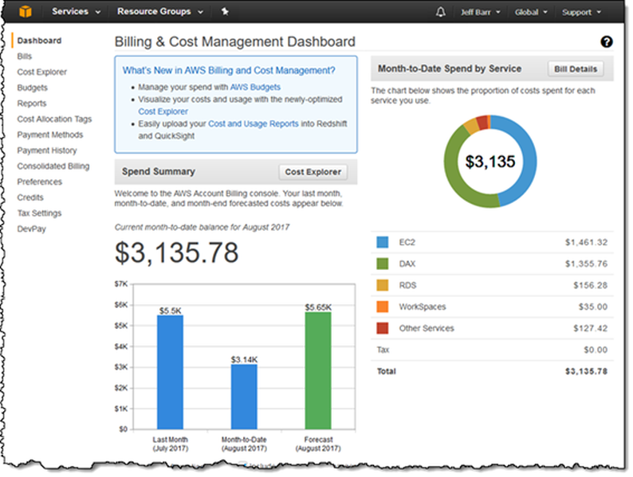
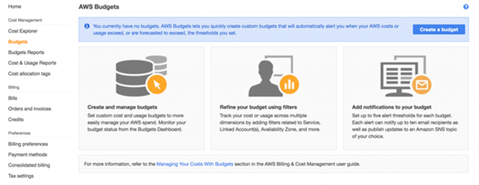
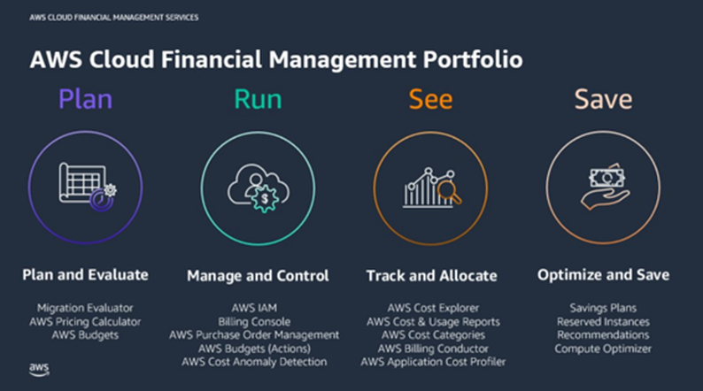
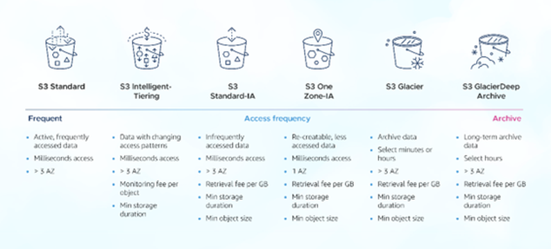
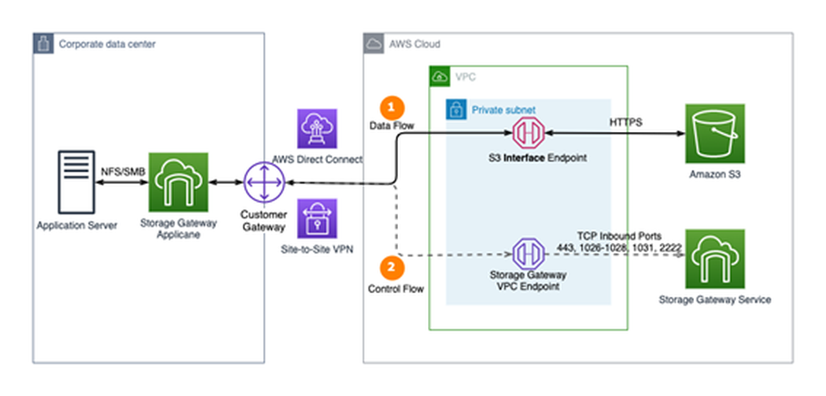
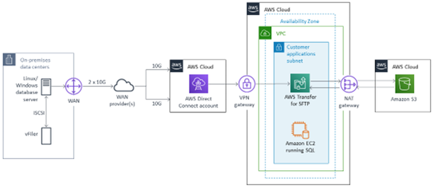
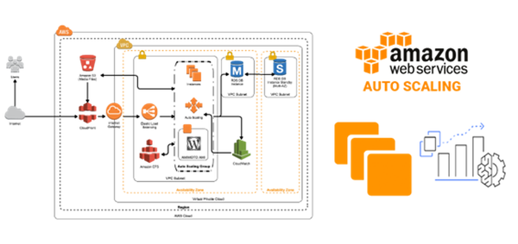
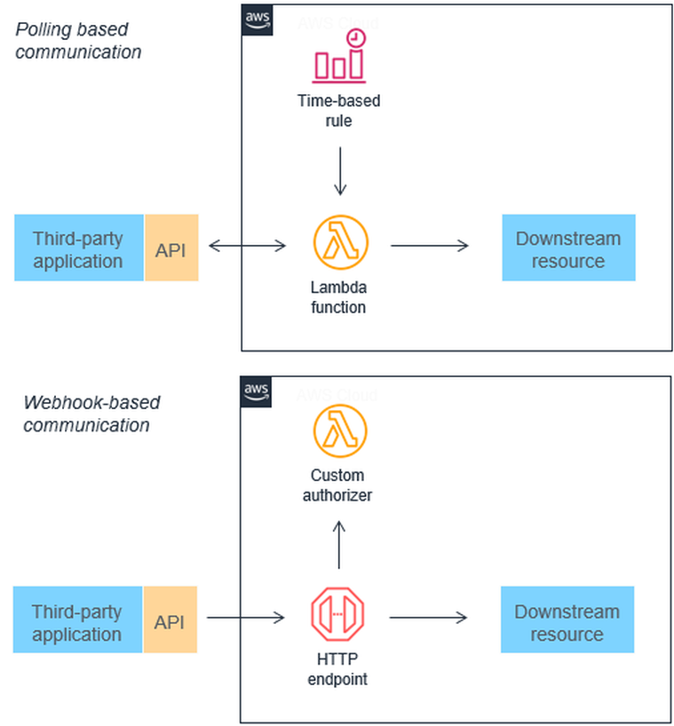
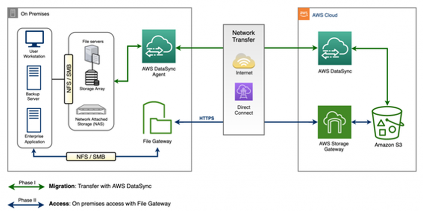

# RELATÓRIO DE IMPLEMENTAÇÃO DE SERVIÇOS AWS

Data: 14/01/2025  
Empresa: Abstergo Industries  
Responsável: Alcino Roberto Soares

## Introdução
Este relatório apresenta o processo de implementação de ferramentas na empresa Abstergo Industries, realizado por Alcino Roberto Soares. O objetivo do projeto foi elencar 3 serviços AWS, com a finalidade de realizar diminuição de custos imediatos.

## Descrição do Projeto
O projeto de implementação de ferramentas foi dividido em 3 etapas, cada uma com seus objetivos específicos. A seguir, serão descritas as etapas do projeto:

### Etapa 1: Governança Financeira e Controle Inicial de Custos
- AWS Cost Explorer + AWS Budgets
- Controle, visibilidade e governança de custos na nuvem AWS
- Nesta etapa inicial, a empresa cria sua primeira conta AWS com foco exclusivo em controle financeiro, evitando gastos desnecessários logo no início da adoção da nuvem.

    As ferramentas permitem:  
    - Visualizar os custos por serviço e período
    - Criar orçamentos mensais  
    - Receber alertas automáticos ao atingir limites definidos
    - Identificar tendências de consumo

    Essa etapa não envolve migração de sistemas, mas estabelece uma base sólida de governança, essencial para evitar desperdícios financeiros durante a evolução do projeto.

### Etapa 2: Redução de Custos com Armazenamento e Backup
- Amazon S3 + AWS Storage Gateway
- Armazenamento em nuvem de baixo custo, backup e arquivamento de dados.
- Nesta etapa, a empresa inicia a migração de dados não críticos e históricos, como:  
    - Documentos fiscais
    - Registros regulatórios
    - Backups de sistemas
    - Dados de auditoria
    
    O AWS Storage Gateway permite a integração entre o ambiente local e a AWS, enquanto o Amazon S3 oferece alta durabilidade e diferentes classes de armazenamento, possibilitando redução significativa de custos ao longo do tempo.

    Com isso, a empresa reduz:
    - Investimentos em hardware
    - Custos com manutenção e energia
    - Riscos de perda de dados

### Etapa 3: Otimização de Processos e Computação Sob Demanda
- Amazon EC2 + Auto Scaling + AWS Lambda
- Execução sob demanda, escalabilidade automática e pagamento por uso.
- Na etapa final, a empresa passa a executar cargas de trabalho específicas na nuvem, priorizando sistemas com variação de demanda, como:  
    - Processamento de pedidos
    - Relatórios de vendas e estoque
    - Integrações com parceiros e distribuidores
    
    O uso combinado das ferramentas permite:
    - Amazon EC2 para aplicações legadas
    - Auto Scaling para ajustar recursos automaticamente
    - AWS Lambda para rotinas event-driven e automações
    
    Essa abordagem elimina servidores ociosos e reduz custos operacionais, mantendo a infraestrutura alinhada à demanda real do negócio.

## Conclusão
A implementação de ferramentas na empresa *Abstergo Industries tem como esperado __o início da sua jornada na nuvem com baixo risco, obter redução de custos desde as primeiras etapas, evolução de forma estruturada para um ambiente cloud e estar preparado para futuras iniciativas de automação e análise de dados__*, o que aumentará a eficiência e a produtividade da empresa. Recomenda-se a continuidade da utilização das ferramentas implementadas e a busca por novas tecnologias que possam melhorar ainda mais os processos da empresa.

## Anexos

Clique em cada item para expandir e visualizar as imagens:

Billing & Cost Management Dashboard - Página inicial centralizada no console da AWS para monitorar e visualizar gastos de forma rápida e intuitiva.

AWS Budgets - Ferramenta do AWS Cost Management que permite monitorar custos e uso da nuvem, definindo orçamentos personalizados para evitar gastos inesperados.

AWS Cloud Financial Management Portfolio - Exibe um conjunto de serviços, ferramentas e recursos da AWS para gerenciar, otimizar e planejar custos na nuvem.

AWS S3 Access Frequency - Níveis de acesso da classe S3 que classificam e movem objetos com base na frequência de uso para otimizar custos de armazenamento.

Arquitetura Híbrida de Armazenamento AWS com S3 Interface Endpoint e Storage Gateway.

Arquitetura de Transferência Segura de Dados de Banco de Dados On‑Premises para Amazon S3 via AWS Direct Connect, VPN e AWS Transfer for SFTP.
.

AWS Auto Scaling.

Comunicação entre Aplicações de Terceiros e Recursos na AWS usando Polling com Lambda e Webhooks via Endpoint HTTP com Autorizador Personalizado.

Migração e Acesso Híbrido a Arquivos On‑Premises para Amazon S3 usando AWS DataSync e AWS Storage Gateway (File Gateway).

 

Assinatura do Responsável pelo Projeto:

<link href="https://fonts.googleapis.com/css2?family=Alex+Brush&display=swap" rel="stylesheet">

Alcino Roberto Soares

 ___________________________________________________________________________________________  

Alcino Roberto Soares

